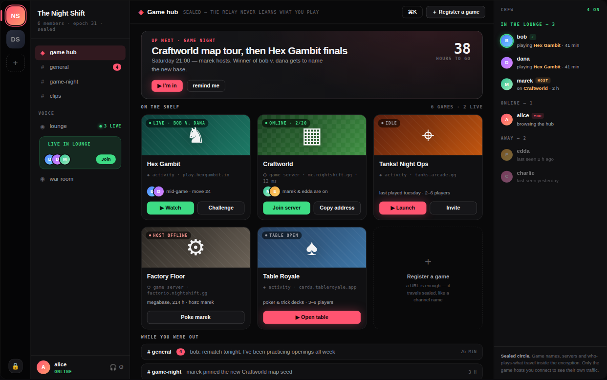
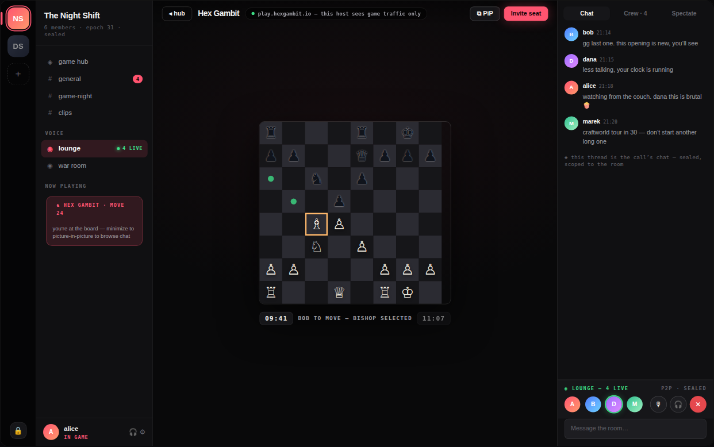
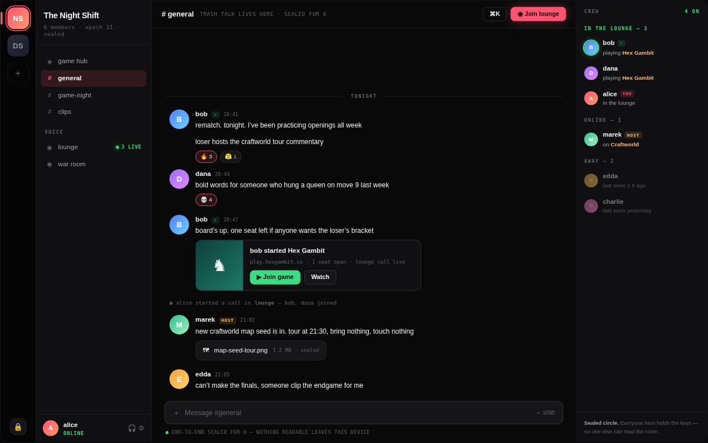
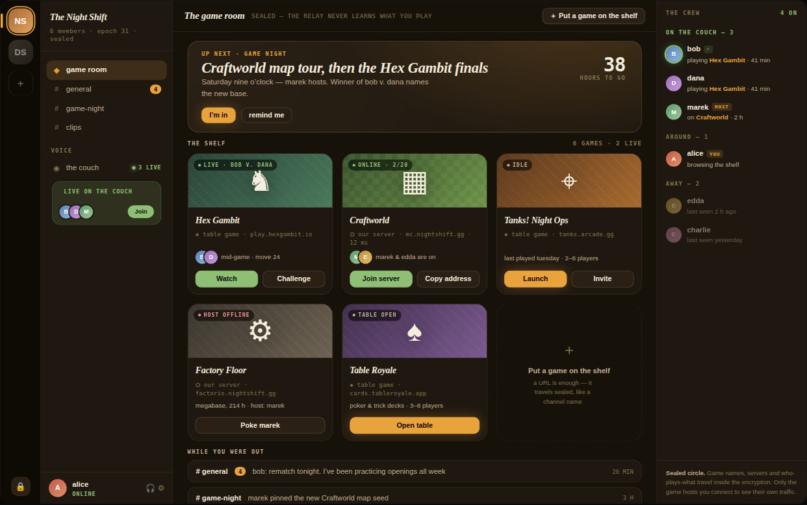

# Game hub — design concepts

Exploration for turning the circle landing page into a **central game hub**:
chat and call as today, plus a shelf of games that live on other servers —
web games launched embedded (Discord-Activities-style iframe + postMessage
contract) and native game servers (Minecraft, Factorio) shown as live
status cards the client polls directly. The relay never learns any of it;
the game registry travels inside the MLS metadata like channel names.

Open [`game-hub-concepts.html`](game-hub-concepts.html) in a browser for the
interactive version (two directions × five screens, with concept notes).

| | |
|---|---|
|  |  |
|  |  |

Directions:

- **01 · Afterdark** — private-arcade look: true OLED black, coral accent,
  presence-green strictly meaning "live", cover art carries the energy.
- **02 · The Den** — game night at someone's place: lamplight palette,
  brass accent, serif display. Same layout skeleton, different skin.

These are static mockups only — no product code changed.
